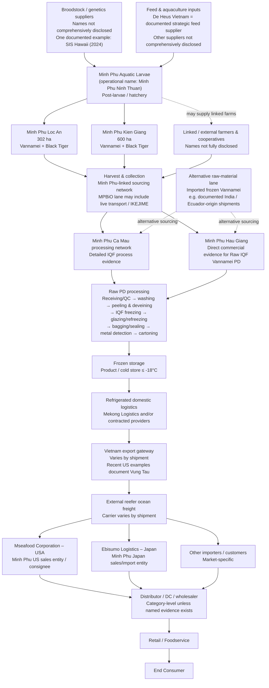

# Minh Phú Seafood – End-to-End Supply Chain Map

> [!summary]
> **Selected product:** Raw IQF Frozen Whiteleg Shrimp (*Penaeus vannamei*) – Peeled & Deveined (PD)  
> **Scope:** Critical inputs → hatchery → farming/raw-material sourcing → harvest & collection → processing → freezing/packing → frozen storage → domestic reefer logistics → export gateway → reefer ocean freight → overseas sales/import entities → retail/foodservice → end consumer.  
> **Evidence principle:** Only named actors and routes supported by public evidence are shown as named nodes. Where exact supplier, farmer, port, carrier, or final customer is not publicly disclosed, the node remains at category level.



## Clean one-line map

**Broodstock / feed / aquaculture inputs → Minh Phu hatchery → owned farms + linked/external farmers → harvest & collection → Minh Phu processing network → Raw PD preparation → IQF freezing → glazing / packing / metal detection → frozen storage → domestic reefer logistics → Vietnam export gateway → reefer ocean freight → Mseafood USA / Ebisumo Japan / other importers → distributor / DC → retail / foodservice → end consumer**

> [!important]
> This is **not** a fully closed vertically owned chain. Minh Phú combines owned farming, linked/external farmers, external suppliers, external ocean carriers, and in some cases imported frozen Vannamei raw material.

---

# 1. Product Definition and System Boundary

## 1.1 Selected product

**Raw IQF Frozen Whiteleg Shrimp (*Penaeus vannamei*) – Peeled & Deveined (PD)**

This product scope is preferred because:

- Minh Phú publicly lists **Vannamei Raw PD** among its raw shrimp product forms.
- Commercial shipment evidence exists for **Raw IQF Vannamei PD** from Minh Phu Hau Giang.
- The Cà Mau processing documentation provides a detailed process for raw IQF shrimp, including whiteleg shrimp.
- PD is a meaningful product form, whereas a size such as 26/30 is only a size grade and would unnecessarily narrow the assignment.

### Product characteristics relevant to the supply chain

- Species: **Whiteleg shrimp / Vannamei**
- Scientific name: ***Penaeus vannamei***
- Product form: **Raw, Peeled & Deveined (PD)**
- Freezing method: **IQF**
- Storage condition in documented process: **≤ -18°C**
- Primary channel: **Export frozen seafood**

---

## 1.2 System boundary

### Included

1. Broodstock / genetics inputs
2. Feed and aquaculture inputs
3. Hatchery and post-larvae
4. Owned farms
5. Linked / external farmers
6. Harvest and collection
7. Processing
8. IQF freezing, glazing and packaging
9. Frozen storage
10. Domestic refrigerated logistics
11. Export gateway
12. Reefer ocean freight
13. Overseas sales / importer entities
14. Distribution, retail / foodservice
15. End consumer

### Excluded from the main path

- **Minh Phu Mangrove**: primarily associated with extensive Black Tiger shrimp farming, not the selected Vannamei chain.
- Detailed waste/by-product flows: can be added later if required.
- Unverified named retailers or restaurant chains.
- Batch-level assumptions that cannot be supported by public evidence.

---

# 2. Supply Chain Architecture

## 2.1 Tier 2 / Critical biological and production inputs

### Broodstock / genetics

Public information does **not** disclose a complete current supplier roster.

One documented example is:

- **Shrimp Improvement Systems (SIS) Hawaii**
- Trade evidence records a 2024 shipment of Vannamei broodstock to Minh Phu Aquatic Larvae.

Correct interpretation:

> SIS Hawaii is a **documented supplier example**, not proven to be Minh Phú's sole or exclusive broodstock supplier.

**Confidence:** Medium

---

### Feed

**De Heus Vietnam** is a documented strategic feed supplier.

A strategic cooperation announced in December 2025 covers:

- shrimp feed,
- nutrition solutions,
- technical support,
- cooperation with Minh Phú farming systems.

Correct interpretation:

> De Heus is a **documented strategic supplier**, but there is no public evidence that it is the exclusive feed supplier for all Minh Phú Vannamei farms.

**Confidence:** High

---

### Other aquaculture inputs

Minh Phu Seafood Supply Chain and AquaMekong are publicly described as providing or supporting areas including:

- broodstock,
- feed,
- post-larvae,
- microbiological products,
- disease / biosecurity knowledge,
- technical farming support.

These roles are useful as **supporting supply-chain functions**, but should not automatically be treated as the physical supplier for every selected-product batch.

**Confidence:** High for organizational role; lower for batch-specific physical flow.

---

# 3. Hatchery

## Minh Phu Aquatic Larvae

Operationally associated with the name **Minh Phu Ninh Thuan**.

Role:

- hatchery,
- shrimp post-larvae production,
- supply into Minh Phú farming system.

Public information indicates BAP and GlobalG.A.P. certification at the hatchery level.

### Important naming note

The company / operational name may still refer to **Ninh Thuận**, while current administrative geography has changed after provincial restructuring. In academic work, keep the entity's operational name and separately state the current administrative location if needed.

**Confidence:** High

---

# 4. Farming and Raw-Material Sourcing

Minh Phú uses a **hybrid sourcing model**, not a completely closed internal farming chain.

## 4.1 Minh Phu Loc An

- Area: **302 ha**
- Species: **Vannamei + Black Tiger**
- Role: company/group farming area
- Raw-material purchases from Loc An are disclosed in Minh Phú financial statements.

**Confidence:** High

---

## 4.2 Minh Phu Kien Giang

- Area: **600 ha**
- Species: **Vannamei + Black Tiger**
- Role: company/group farming area
- Raw-material purchases from Kien Giang are disclosed in Minh Phú financial statements.

**Confidence:** High

---

## 4.3 Linked and external farmers

Minh Phú also relies on:

- linked farmers,
- cooperatives,
- external raw-material suppliers,
- MPBiO-linked farming systems.

The full farmer list is not publicly disclosed.

### Important correction

Minh Phú's 2024 reporting indicated that raw material from its own farming areas accounted for only about **10% self-sufficiency at that time**.

The stated direction toward approximately **50% raw-material self-sufficiency** is a **long-term target toward 2035**, not a statement of current performance.

Therefore:

> **Current system = owned farms + linked farmers + external sourcing**

not:

> **Minh Phú currently self-supplies 50% of all shrimp raw material.**

**Confidence:** High

---

# 5. Harvest and Collection

The safe main-chain node is:

**Harvest & collection within Minh Phú's owned / linked raw-material network**

Minh Phu Seafood Supply Chain is publicly described as supporting or supervising cultivation and harvest.

## MPBiO-specific lane

For the MPBiO premium lane, public information supports:

- live shrimp transport to factory,
- IKEJIME / temperature-controlled handling,
- immediate processing.

However:

> This must **not** be generalized to every Minh Phú Vannamei batch.

Therefore the clean map should show:

**Harvest & collection**

with a note:

**MPBiO premium lane may include live transport and IKEJIME.**

**Confidence:** High for the existence of the MPBiO practice; not universal.

---

# 6. Processing Network

## 6.1 Minh Phu Cà Mau

Cà Mau has the strongest detailed process evidence.

A government-hosted environmental document describes a raw IQF shrimp process that includes Vannamei.

This source is especially useful for:

- receiving,
- inspection,
- washing,
- preparation,
- freezing,
- glazing,
- refreezing,
- packing,
- metal detection,
- frozen storage,
- temperature requirements.

**Confidence:** High

---

## 6.2 Minh Phu Hau Giang

Hậu Giang has strong commercial evidence for actual:

**Raw IQF Vannamei PD**

exports.

Therefore:

- **Cà Mau** gives the strongest process-level evidence.
- **Hậu Giang** gives the strongest selected-product commercial evidence.

### Important limitation

Public data does not prove:

> a specific Vannamei batch from Loc An or Kien Giang went to a particular factory.

Therefore the academically safe wording is:

> **Minh Phu processing network – Cà Mau and/or Hậu Giang; exact batch-to-plant routing not publicly disclosed.**

**Confidence:** High at company/network level.

---

## 6.3 Minh Phu Khanh An

Minh Phu Khanh An is a current processing facility that became operational in 2026.

However, for the selected product:

> exact routing of Raw IQF Vannamei PD through Khanh An is not publicly established.

Therefore Khanh An should be mentioned in the detailed notes but does **not** need to appear in the selected-product clean path.

---

# 7. Processing Flow for Raw IQF Vannamei PD

A supply-chain-relevant simplified flow is:

```text
Raw shrimp receiving
        ↓
Incoming quality inspection
        ↓
Washing
        ↓
Peeling & deveining / product preparation
        ↓
Treatment / washing
        ↓
IQF freezing
        ↓
Glazing
        ↓
Refreezing
        ↓
Weighing / bagging / sealing
        ↓
Metal detection
        ↓
Cartoning
        ↓
Frozen storage
```

## Documented process temperatures

The Cà Mau process documentation gives parameters including:

- IQF freezer: approximately **-33°C to -35°C**
- Product core after freezing: **≤ -18°C**
- Glazing water: approximately **0°C to 2°C**
- Refreezing: approximately **-33°C to -35°C**
- Frozen storage: **≤ -18°C**
- Refrigerated transport / container: **≤ -18°C**

These temperatures are stronger evidence than generic industry assumptions because they come from a facility-specific regulatory document.

---

# 8. Cold Storage and Domestic Logistics

## 8.1 Plant cold storage

After processing and packing, the product enters frozen storage.

For the documented Cà Mau process:

> Finished frozen shrimp is stored at **≤ -18°C**.

**Confidence:** High

---

## 8.2 Mekong Logistics

Mekong Logistics is publicly associated with:

- cold storage,
- transportation,
- domestic and international logistics,
- container / port-related services.

It has been part of Minh Phú's documented logistics ecosystem.

### Important ownership correction

Historic Minh Phú materials showed Mekong Logistics as an associate / related logistics entity.

However, the ownership structure changed in 2026 through transactions involving Gemadept and CJ Logistics.

Therefore, in the current clean map:

> **Mekong Logistics should be treated as a documented logistics service provider, not automatically described as a current Minh Phú-owned associate/JV.**

### Route logic

The safe logistics node is:

> **Mekong Logistics and/or contracted refrigerated logistics providers**

because there is no public batch-level evidence that every selected shipment passes through Mekong Logistics.

**Confidence:** High for logistics capability and historic/current service relationship; lower for individual shipment routing.

---

# 9. Export Gateway

Minh Phú does **not** use one fixed export port for every shipment.

Current shipment evidence shows recent US-bound cargo using:

- **Vung Tau, Vietnam**

Other ports may be used depending on shipment.

Therefore the clean map should say:

> **Vietnam export gateway – varies by shipment**

and optionally note:

> **Recent US shipment examples document Vung Tau.**

Do **not** state:

> All Minh Phú Vannamei exports leave via Cat Lai.

**Confidence:** High for the principle that port varies; Medium–High for individual observed routes.

---

# 10. Reefer Ocean Freight

Frozen shrimp is transported internationally in refrigerated containers.

The ocean carrier varies by shipment.

Therefore:

> **External reefer ocean carrier – varies by shipment**

is more accurate than naming one carrier as a permanent Tier-1 supplier.

Some observed US shipments use reefer set points around **-21°C**.

This is not inconsistent with the factory requirement of **≤ -18°C**, because -21°C is colder than -18°C and may be a shipment-specific set point.

---

# 11. Downstream Chain

## 11.1 United States – Mseafood Corporation

Mseafood Corporation is a well-supported downstream node.

Evidence supports:

- Minh Phú identifies Mseafood as its US sales entity.
- Minh Phú financial statements record significant finished-goods sales to Mseafood.
- Current bill-of-lading evidence shows frozen shrimp shipments from Minh Phú entities to Mseafood.

Safe chain:

**Minh Phu Vietnam → reefer ocean freight → Mseafood USA → distributor / DC / downstream customer → retail / foodservice → consumer**

**Confidence:** High

---

## 11.2 Japan – Ebisumo Logistics

Ebisumo is a strong Japan downstream node.

Evidence supports:

- Minh Phú identifies Ebisumo as a Japan sales entity.
- Ebisumo describes itself as importing / clearing Minh Phú frozen products for the Japanese market.
- Minh Phú financial statements record finished-goods sales to Ebisumo.

Safe chain:

**Minh Phu Vietnam → Ebisumo Japan → Japanese domestic customers → retail / foodservice → consumer**

**Confidence:** High

---

## 11.3 Final retailer / foodservice

The selected-product public evidence does not reliably identify one final retailer or restaurant chain.

Therefore the correct map remains at category level:

- importer,
- distributor,
- wholesaler,
- distribution center,
- retail,
- foodservice,
- end consumer.

Do not insert a named supermarket, restaurant, or foodservice company without SKU-level or shipment-level evidence.

---

# 12. Alternative Raw-Material Lane

Public trade data shows that Minh Phú also imports frozen Vannamei raw material from foreign suppliers.

Documented origins include examples from countries such as:

- Ecuador,
- India.

Therefore Minh Phú's processing system may receive raw material through a second sourcing path:

```text
Foreign frozen Vannamei supplier
        ↓
Imported frozen raw material
        ↓
Minh Phu processing
```

This lane is separate from:

```text
Broodstock
→ hatchery
→ domestic farm
→ harvest
→ processing
```

### Key implication

It is incorrect to assume:

> All Vannamei processed by Minh Phú must have passed through Minh Phú's own hatchery and domestic farm network.

**Confidence:** Medium, based mainly on commercial trade databases.

---

# 13. Supporting Flows

## 13.1 Physical product flow

```text
Inputs
→ hatchery
→ farm / raw-material source
→ harvest
→ processing
→ frozen storage
→ reefer logistics
→ export
→ importer / sales entity
→ distribution
→ retail / foodservice
→ consumer
```

---

## 13.2 Information / traceability flow

```text
Hatchery records
↔ farm records
↔ harvest lot
↔ processing lot
↔ packing / shipment documentation
↔ importer / market compliance information
```

Minh Phú publicly discusses:

- digitized supply-chain data,
- electronic farming records,
- IoT / farm monitoring,
- traceability across the value chain.

This information flow is therefore evidence-supported.

---

## 13.3 Order / forecast flow

Conceptual supply-chain flow:

```text
Market / overseas sales
↔ Minh Phu export / sales planning
↔ processing
↔ sourcing / farming network
```

> [!note]
> This is a **conceptual supply-chain representation**, not a claim that Minh Phú has publicly disclosed a specific forecast architecture or ERP flow.

---

## 13.4 Financial flow

Conceptual direction:

```text
End customer / downstream buyer
→ distributor / importer
→ Minh Phu
→ suppliers / farms / logistics providers
```

Again, this is an analytical supply-chain flow, not a disclosed detailed cash-flow diagram.

---

# 14. Evidence Table

| ID | Node | Actor / Company | Location | Input | Output | Next Node | Evidence Basis | Confidence |
|---|---|---|---|---|---|---|---|---|
| U1 | Broodstock / genetics | Supplier category; SIS Hawaii = one documented example | International → Vietnam | Vannamei broodstock | Broodstock | Hatchery | 2024 trade record | Medium |
| U2 | Feed | De Heus Vietnam | Vietnam | Feed ingredients / formulated aquafeed | Shrimp feed | Farms | Strategic cooperation, 2025 | High |
| U3 | Aquaculture support | Minh Phu Seafood Supply Chain / AquaMekong | Vietnam | Technical inputs / support | Farming inputs / know-how | Farms | Official Minh Phu value-chain information | High for role |
| H1 | Hatchery | Minh Phu Aquatic Larvae | Vietnam | Broodstock + hatchery inputs | Post-larvae | Farms | Official Minh Phu source | High |
| F1 | Owned farm | Minh Phu Loc An | Vietnam | PL + feed + farming inputs | Market-size shrimp | Harvest | Official Minh Phu + financial raw-material purchases | High |
| F2 | Owned farm | Minh Phu Kien Giang | Vietnam | PL + feed + farming inputs | Market-size shrimp | Harvest | Official Minh Phu + financial raw-material purchases | High |
| F3 | Linked / external farming | Farmers / cooperatives / external suppliers | Vietnam | PL / feed / production inputs | Market-size shrimp | Harvest / collection | Annual report / linked farming disclosures | High at category level |
| H2 | Harvest & collection | Minh Phu-linked sourcing network | Farm sites | Live / harvested shrimp | Raw shrimp | Processor | Official supply-chain role | High |
| H3 | MPBiO premium harvest lane | MPBiO network | Farm → factory | Live shrimp | Premium handled raw shrimp | Processing | Minh Phu MPBiO disclosures | High for lane-specific practice |
| P1 | Processing | Minh Phu Cà Mau | Cà Mau area | Raw shrimp | Raw IQF frozen shrimp | Frozen storage | Government-hosted process document | High |
| P2 | Processing | Minh Phu Hau Giang | Mekong Delta | Raw shrimp | Raw IQF Vannamei PD | Frozen storage / export | Commercial shipment evidence | High |
| P3 | Current processing network | Minh Phu Khanh An | Cà Mau area | Seafood raw material | Processed products | Distribution | 2026 current facility evidence | High for facility existence; unproven for selected-product routing |
| C1 | Frozen storage | Plant cold storage | Vietnam | Packed frozen shrimp | Frozen inventory | Domestic logistics | Documented process ≤ -18°C | High |
| C2 | Logistics | Mekong Logistics / contracted providers | Vietnam | Frozen seafood | Refrigerated cargo | Export gateway | Official/company/financial evidence | High at service-provider level |
| L1 | Export gateway | Vietnamese port | Vietnam | Reefer container | Export cargo | Ocean freight | Shipment records; port varies | High at category level |
| L2 | Ocean freight | External reefer carrier | International | Reefer container | Imported frozen cargo | Overseas entity | Bill-of-lading evidence | High at category level |
| D1 | US downstream | Mseafood Corporation | USA | Minh Phu frozen shrimp | US market product | Distributor / customer | Official site + BCTC + BOL | High |
| D2 | Japan downstream | Ebisumo Logistics | Japan | Minh Phu frozen shrimp | Japanese market product | Domestic customers | Official site + BCTC | High |
| D3 | Final downstream | Distributor / DC / retail / foodservice | Destination market | Frozen shrimp | Sold / served product | Consumer | Category-level logic | Medium at category level |
| S1 | Alternative sourcing | Foreign frozen Vannamei suppliers | International | Frozen raw Vannamei | Imported raw material | Minh Phu processing | Trade databases | Medium |

---

# 15. Fact vs Inference

| Statement | Classification |
|---|---|
| Minh Phu Aquatic Larvae operates as a hatchery / PL node | **FACT** |
| Loc An farms Vannamei | **FACT** |
| Kien Giang farms Vannamei | **FACT** |
| Minh Phú purchases raw material from Loc An / Kien Giang entities | **FACT** |
| De Heus is a documented strategic feed supplier | **FACT** |
| Cà Mau has a documented raw IQF process applicable to whiteleg shrimp | **FACT** |
| IQF freezer operates around -33°C to -35°C in the documented process | **FACT** |
| Finished product / cold storage is maintained at ≤ -18°C in the documented process | **FACT** |
| Hau Giang has commercial evidence for Raw IQF Vannamei PD | **FACT** |
| Mseafood receives Minh Phú finished goods | **FACT** |
| Ebisumo receives / handles Minh Phú finished goods for Japan | **FACT** |
| Mekong Logistics has cold-storage and transport capability | **FACT** |
| Mekong Logistics handles every selected shrimp shipment | **NOT PROVEN** |
| All Vannamei is produced from Minh Phú's own hatchery | **NOT PROVEN / UNSUPPORTED GENERALIZATION** |
| All Vannamei is grown on company-owned farms | **FALSE / UNSUPPORTED** |
| Minh Phú is currently 50% raw-material self-sufficient | **INCORRECT** |
| 50% self-sufficiency is a long-term target toward 2035 | **FACT / STRATEGIC TARGET** |
| All shrimp uses live transport and IKEJIME | **UNSUPPORTED GENERALIZATION** |
| All exports use one port | **FALSE / UNSUPPORTED** |
| All exports use one ocean carrier | **FALSE / UNSUPPORTED** |
| One specific Loc An batch becomes one specific Mseafood shipment | **NOT PUBLICLY PROVEN** |
| A specific retailer sells the selected SKU | **NOT PUBLICLY PROVEN** |

---

# 16. Routine Supply-Chain Issues Relevant to Minh Phú

## 16.1 Disease and biosecurity risk

Shrimp aquaculture is exposed to biological disease risk.

This is especially relevant because Minh Phú's farming strategy discusses:

- disease control,
- broodstock quality,
- biosecurity,
- improved farming models.

**Supply-chain implication:** mortality and yield variability can disrupt raw-material availability.

---

## 16.2 Raw-material availability

Minh Phú is not fully self-sufficient in shrimp raw materials.

It relies on a combination of:

- owned farms,
- linked farmers,
- external procurement,
- imported frozen raw material in some cases.

**Supply-chain implication:** sourcing coordination and supplier quality control are central to continuity.

---

## 16.3 Feed and input dependency

Feed is a major production input.

The De Heus partnership confirms the strategic importance of:

- feed quality,
- nutrition,
- technical farming support.

**Supply-chain implication:** feed cost, formulation and availability affect production cost and biological yield.

---

## 16.4 Cold-chain integrity

Frozen shrimp requires uninterrupted temperature control.

The documented process requires:

- product core ≤ -18°C after freezing,
- frozen storage ≤ -18°C,
- refrigerated transport ≤ -18°C.

**Supply-chain implication:** temperature excursions can create quality, safety and customer-rejection risk.

---

## 16.5 Food safety and quality compliance

Export seafood must comply with:

- chemical residue requirements,
- microbiological safety,
- product specifications,
- importer-country requirements,
- plant quality systems.

**Supply-chain implication:** a failure at farming or processing stage can block market access.

---

## 16.6 Traceability

Minh Phú operates across:

- hatchery,
- farms,
- external farmers,
- processing,
- logistics,
- multiple export markets.

**Supply-chain implication:** traceability is needed to connect raw material, processing lot and export documentation.

---

## 16.7 Export lead time and ocean freight

Minh Phú depends heavily on international reefer transport.

**Supply-chain implication:**

- long physical lead times,
- reefer availability,
- port congestion,
- ocean schedule changes,
- import clearance,
- cold-chain continuity.

---

## 16.8 Frozen inventory

Frozen shrimp can be stored longer than chilled seafood, but frozen inventory creates:

- working-capital cost,
- freezer-storage cost,
- demand mismatch risk,
- potential aged inventory risk.

This is directly relevant to production planning and export demand forecasting.

---

# 17. Public Information Gaps

The following items are **not sufficiently public** and should not be invented:

1. Full current broodstock supplier roster.
2. Full current feed supplier roster.
3. Whether De Heus is exclusive.
4. Full list of linked Vannamei farmers / cooperatives.
5. Farmer-by-farmer production volume.
6. Exact farm → plant routing for a selected shipment.
7. Exact preservation method for every non-MPBiO harvest.
8. Exact share of own-farm versus linked-farmer versus external raw material in 2026.
9. Whether Mekong Logistics handles a particular selected container.
10. Exact share of shipments by each Vietnamese port.
11. Exact ocean-carrier allocation by destination.
12. Final retailer / restaurant for the selected Raw IQF Vannamei PD SKU.
13. Exact farm origin of a specific Mseafood shipment.
14. Complete current certification status for every pond, farm and plant.

> [!important]
> In the assignment, use **“Not publicly disclosed”** rather than filling these gaps with assumptions.

---

# 18. Corporate-Structure and Source Cautions

## 18.1 Mekong Logistics

Historical Minh Phú reporting showed Mekong Logistics as an associate / related logistics entity.

In 2026, ownership changed through transactions involving Gemadept and CJ Logistics.

Therefore:

- **keep Mekong Logistics as a logistics actor,**
- **do not present old Minh Phú ownership percentages as a current fact.**

---

## 18.2 Factory capacity inconsistency

Minh Phú's official business-areas page contains inconsistent capacity figures for Cà Mau and Hậu Giang between the summary and detailed sections.

Therefore:

> **Factory capacity should be omitted from the clean map unless independently reconciled.**

This does not affect the supply-chain structure.

---

## 18.3 Certifications

Certifications must be treated carefully.

Distinguish between:

- company-declared certification,
- certification assessment / reassessment record,
- independently verified currently active certificate.

Do not assume:

> one certified farm = every farm, every pond and every shipment is certified.

---

# 19. Recommended Presentation Version

For a class slide, use only the following simplified chain:

```text
Broodstock / feed / aquaculture inputs
                ↓
      Minh Phu Hatchery
                ↓
Owned farms + linked/external farmers
                ↓
       Harvest & collection
                ↓
   Minh Phu processing network
       Cà Mau / Hậu Giang
                ↓
Raw PD preparation → IQF → glazing → packing
                ↓
       Frozen storage ≤ -18°C
                ↓
      Reefer inland logistics
                ↓
       Vietnam export gateway
                ↓
       Reefer ocean freight
                ↓
 Mseafood USA / Ebisumo Japan / other importer
                ↓
 Distributor / DC / wholesaler
                ↓
       Retail / Foodservice
                ↓
          End Consumer
```

Add one dashed side branch:

```text
Imported frozen Vannamei
          ↓
   Minh Phu processing
```

This version is concise enough for a supply-chain map while preserving the major structural reality of Minh Phú's sourcing system.

---

# 20. Suggested Oral Explanation

If asked to explain the chain in class:

> Minh Phú has a partially vertically integrated shrimp supply chain. It operates hatchery and farming assets, but it does not rely only on company-owned farms. Raw material is sourced through a combination of owned farms, linked farmers, external procurement and, in some cases, imported frozen Vannamei. The shrimp is processed within Minh Phú's processing network, where raw PD products can be IQF frozen, glazed, packed and stored under frozen conditions. Product then moves through refrigerated domestic logistics to export ports, followed by reefer ocean freight. In major downstream markets, Minh Phú uses entities such as Mseafood in the United States and Ebisumo in Japan before the product reaches distributors, retail or foodservice customers.

---

# 21. Core Sources

> [!note]
> These are the main evidence sources used to build the map. They should be cited selectively in the assignment rather than listing every source on the slide.

## Minh Phú official sources

- Minh Phú – Business Areas / Value Chain  
  https://minhphu.com/en/hoat-dong/

- Minh Phú – Raw Products  
  https://minhphu.com/en/collection/raw/

- Minh Phú – MPBiO  
  https://minhphu.com/en/brand/mpbio/

## Annual report / financial disclosures

- Minh Phú Annual Report 2024  
  https://file.fpts.com.vn/FileStore2/File/2025/04/17/MPC_2025-4-17_57e367c_VI_Baocaothuongnien2024_signed.pdf

- Minh Phú Annual Report 2025  
  https://cafef1.mediacdn.vn/download/200426/mpc-bao-cao-thuong-nien-2025-0-609618.pdf

- Minh Phú audited 2025 financial statements  
  https://static2.vietstock.vn/vietstock/2026/3/30/2_mpc_2026_3_30_e6449c7_en_baocaotaichinh_ctyme_kiemtoan_2025_signed.pdf

## Processing / regulatory

- Cà Mau shrimp processing environmental / technical document  
  https://thamvan.mae.gov.vn/Uploads/03102023/22B%C3%A1o%20c%C3%A1o%20%C4%91%E1%BB%81%20xu%E1%BA%A5t%20c%E1%BB%A7a%20C%C3%B4ng%20ty.pdf

## Feed supplier

- De Heus – Strategic cooperation with Minh Phú, 18 December 2025  
  https://www.deheus.com.vn/kham-pha-va-hoc-hoi/tin-tuc/le-ky-ket-hop-tac-chien-luoc-giua-de-heus-minh-phu-ve-phat-trien-ben-vung-chuoi-gia-tri-nganh-tom

## Japan downstream

- Ebisumo Logistics  
  https://www.ebisumo.com/about

## Current logistics / corporate-structure context

- Gemadept disclosure on Mekong Logistics, 1 July 2026  
  https://staticfile.hsx.vn/Uploads/UploadDocuments/2476309/20260701%20-%20GMD%20-%20Completing%20the%20acquisition%20of%20capital%20contribution.pdf

- Gemadept IR Newsletter 2026  
  https://www.gemadept.com.vn/wp-content/uploads/2026/05/BAN-TIN-IR-Q12026-1.pdf

## Supporting commercial / shipment evidence

Commercial trade databases are useful for shipment-level corroboration but should normally be treated as **secondary evidence**:

- ImportInfo  
  https://www.importinfo.com/

- Volza  
  https://www.volza.com/

- NBD Trade Data  
  https://en.nbd.ltd/

- TradeIMEX  
  https://www.tradeimex.in/

---

# 22. Final Takeaway

The most defensible description of Minh Phú's selected product chain is:

> **A partially vertically integrated, export-oriented frozen shrimp supply chain combining Minh Phú hatchery and farming assets with linked/external raw-material sourcing, industrial IQF processing, controlled frozen logistics, reefer ocean freight, and overseas sales/import entities such as Mseafood and Ebisumo.**

The map should **not** imply that:

- every shrimp originates from Minh Phú's own hatchery,
- every shrimp is grown on company-owned farms,
- every shipment uses Mekong Logistics,
- every container leaves from one port,
- every shipment uses one ocean carrier,
- or one named retailer receives all selected-product shipments.

The strongest academic version is therefore the version that keeps named actors only where evidence supports them and uses generic category-level nodes where public information ends.
