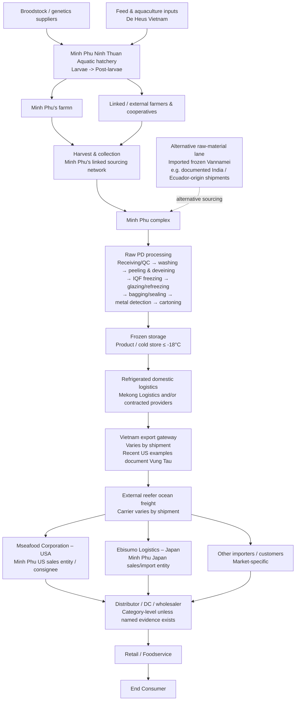

# Minh Phú Seafood – End-to-End Supply Chain Map

> [!summary]
> **Selected product:** Raw IQF Frozen Whiteleg Shrimp (*Penaeus vannamei*) – Peeled & Deveined (PD)  
> **Scope:** Critical inputs → hatchery → farming/raw-material sourcing → harvest & collection → processing → freezing/packing → frozen storage → domestic reefer logistics → export gateway → reefer ocean freight → overseas sales/import entities → retail/foodservice → end consumer.  
> **Mapping principle:** The map uses named actors where available and category-level nodes for the remaining parts of the chain.



## Clean one-line map

**Broodstock / feed / aquaculture inputs → Minh Phu hatchery → owned farms + linked/external farmers → harvest & collection → Minh Phu processing network → Raw PD preparation → IQF freezing → glazing / packing / metal detection → frozen storage → domestic reefer logistics → Vietnam export gateway → reefer ocean freight → Mseafood USA / Ebisumo Japan / other importers → distributor / DC → retail / foodservice → end consumer**

> [!important]
> This is **not** a fully closed vertically owned chain. Minh Phú combines owned farming, linked/external farmers, external suppliers, external ocean carriers, and in some cases imported frozen Vannamei raw material.

---

# 1. Product Definition and System Boundary

## 1.1 Selected product

**Raw IQF Frozen Whiteleg Shrimp (*Penaeus vannamei*) – Peeled & Deveined (PD)**

This product scope is preferred because:

- Minh Phú publicly lists **Vannamei Raw PD** among its raw shrimp product forms.
- Commercial shipment evidence exists for **Raw IQF Vannamei PD** from Minh Phu Hau Giang.
- The Cà Mau processing documentation provides a detailed process for raw IQF shrimp, including whiteleg shrimp.
- PD is a meaningful product form, whereas a size such as 26/30 is only a size grade and would unnecessarily narrow the assignment.

### Product characteristics relevant to the supply chain

- Species: **Whiteleg shrimp / Vannamei**
- Scientific name: ***Penaeus vannamei***
- Product form: **Raw, Peeled & Deveined (PD)**
- Freezing method: **IQF**
- Storage condition in documented process: **≤ -18°C**
- Primary channel: **Export frozen seafood**

---

## 1.2 System boundary

### Included

1. Broodstock / genetics inputs
2. Feed and aquaculture inputs
3. Hatchery and post-larvae
4. Owned farms
5. Linked / external farmers
6. Harvest and collection
7. Processing
8. IQF freezing, glazing and packaging
9. Frozen storage
10. Domestic refrigerated logistics
11. Export gateway
12. Reefer ocean freight
13. Overseas sales / importer entities
14. Distribution, retail / foodservice
15. End consumer

### Excluded from the main path

- **Minh Phu Mangrove**: primarily associated with extensive Black Tiger shrimp farming, not the selected Vannamei chain.
- Detailed waste/by-product flows: can be added later if required.
- Unverified named retailers or restaurant chains.
- Batch-level assumptions that cannot be supported by public evidence.

---

# 2. Supply Chain Architecture

## 2.1 Tier 2 / Critical biological and production inputs

### Broodstock / genetics

A documented broodstock supplier example is **Shrimp Improvement Systems (SIS) Hawaii**. Trade records show a 2024 shipment of Vannamei broodstock to Minh Phu Aquatic Larvae.


---

### Feed

**De Heus Vietnam** is a strategic feed supplier in Minh Phú's farming system.

A strategic cooperation announced in December 2025 covers:

- shrimp feed,
- nutrition solutions,
- technical support,
- cooperation with Minh Phú farming systems.


---

### Other aquaculture inputs

Minh Phu Seafood Supply Chain and AquaMekong are publicly described as providing or supporting areas including:

- broodstock,
- feed,
- post-larvae,
- microbiological products,
- disease / biosecurity knowledge,
- technical farming support.

These functions support hatchery and farming operations across Minh Phú's supply chain.


---

# 3. Hatchery

## Minh Phu Aquatic Larvae

Operationally associated with the name **Minh Phu Ninh Thuan**.

Role:

- hatchery,
- shrimp post-larvae production,
- supply into Minh Phú farming system.

Public information indicates BAP and GlobalG.A.P. certification at the hatchery level.

The operational name **Minh Phu Ninh Thuan** is retained in this note, although current administrative geography has changed after provincial restructuring.


---

# 4. Farming and Raw-Material Sourcing

Minh Phú uses a **hybrid sourcing model**, not a completely closed internal farming chain.

## 4.1 Minh Phu Loc An

- Area: **302 ha**
- Species: **Vannamei + Black Tiger**
- Role: company/group farming area
- Raw-material purchases from Loc An are disclosed in Minh Phú financial statements.


---

## 4.2 Minh Phu Kien Giang

- Area: **600 ha**
- Species: **Vannamei + Black Tiger**
- Role: company/group farming area
- Raw-material purchases from Kien Giang are disclosed in Minh Phú financial statements.


---

## 4.3 Linked and external farmers

Minh Phú also relies on:

- linked farmers,
- cooperatives,
- external raw-material suppliers,
- MPBiO-linked farming systems.


Minh Phú's 2024 reporting indicated that raw material from its own farming areas accounted for only about **10% self-sufficiency at that time**.

The stated direction toward approximately **50% raw-material self-sufficiency** is a **long-term target toward 2035**.

The current sourcing system combines **owned farms + linked farmers + external sourcing**.


---

# 5. Harvest and Collection

**Harvest & collection within Minh Phú's owned / linked raw-material network**

Minh Phu Seafood Supply Chain is publicly described as supporting or supervising cultivation and harvest.

## MPBiO-specific lane

The MPBiO premium lane includes:

- live shrimp transport to factory,
- IKEJIME / temperature-controlled handling,
- immediate processing.

These practices belong to the **MPBiO premium lane** within the broader harvest and collection stage.


---

# 6. Processing Network

Minh Phú operates multiple shrimp-processing facilities. For the selected Raw IQF Vannamei PD chain, **Cà Mau and Hậu Giang are parallel processing nodes** rather than sequential stages.

## 6.1 Minh Phu Cà Mau Complex

The Cà Mau complex processes raw shrimp, including Vannamei, through Raw IQF / PD operations.

Main functions relevant to this supply chain:

- receiving and quality inspection,
- washing and product preparation,
- peeling and deveining,
- IQF freezing,
- glazing and refreezing,
- packing and metal detection,
- frozen storage.

Cà Mau acts as a major processing complex within Minh Phú's production network.

---

## 6.2 Minh Phu Hau Giang

Minh Phu Hau Giang also processes **Raw IQF Vannamei PD**.

Main functions relevant to this supply chain:

- Raw IQF / PD processing,
- frozen storage,
- packaging,
- access to container-port logistics.

Hậu Giang therefore performs the same core processing role as Cà Mau, with a particularly clear connection to export logistics.

---

## 6.3 Minh Phu Khanh An

Minh Phu Khanh An is a current processing facility that became operational in 2026 and forms part of Minh Phú's broader processing network.

---

# 7. Processing Flow for Raw IQF Vannamei PD

A supply-chain-relevant simplified flow is:

```text
Raw shrimp receiving
        ↓
Incoming quality inspection
        ↓
Washing
        ↓
Peeling & deveining / product preparation
        ↓
Treatment / washing
        ↓
IQF freezing
        ↓
Glazing
        ↓
Refreezing
        ↓
Weighing / bagging / sealing
        ↓
Metal detection
        ↓
Cartoning
        ↓
Frozen storage
```

## Documented process temperatures

The Cà Mau process documentation gives parameters including:

- IQF freezer: approximately **-33°C to -35°C**
- Product core after freezing: **≤ -18°C**
- Glazing water: approximately **0°C to 2°C**
- Refreezing: approximately **-33°C to -35°C**
- Frozen storage: **≤ -18°C**
- Refrigerated transport / container: **≤ -18°C**

These temperatures come from a facility-specific regulatory document.

---

# 8. Cold Storage and Domestic Logistics

## 8.1 Plant cold storage

After processing and packing, the product enters frozen storage.

For the documented Cà Mau process:

> Finished frozen shrimp is stored at **≤ -18°C**.


---

## 8.2 Mekong Logistics

Mekong Logistics is publicly associated with:

- cold storage,
- transportation,
- domestic and international logistics,
- container / port-related services.

It is part of Minh Phú's logistics ecosystem.

Historic Minh Phú materials showed Mekong Logistics as an associate / related logistics entity.

However, the ownership structure changed in 2026 through transactions involving Gemadept and CJ Logistics.

For the supply-chain map, the domestic logistics stage is represented by **Mekong Logistics and/or contracted refrigerated logistics providers**.


---

# 9. Export Gateway

Minh Phú uses different Vietnamese export gateways depending on the shipment. Recent US-bound shipments include **Vung Tau, Vietnam**.


---

# 10. Reefer Ocean Freight

Frozen shrimp is transported internationally in refrigerated containers.

Ocean carriers vary by shipment and frozen shrimp moves in refrigerated containers. Observed US shipments include reefer set points around **-21°C**, while the documented factory cold-chain requirement is **≤ -18°C**.

---

# 11. Downstream Chain

## 11.1 United States – Mseafood Corporation

Mseafood Corporation is Minh Phú's US sales / downstream entity and receives finished shrimp products from Minh Phú in Vietnam.

**Minh Phu Vietnam → reefer ocean freight → Mseafood USA → distributor / DC / downstream customer → retail / foodservice → consumer**


---

## 11.2 Japan – Ebisumo Logistics

Ebisumo Logistics is Minh Phú's Japan sales / import entity and handles Minh Phú frozen products for the Japanese market.

**Minh Phu Vietnam → Ebisumo Japan → Japanese domestic customers → retail / foodservice → consumer**


---

## 11.3 Final retailer / foodservice

The final downstream stage is represented at category level:

- importer,
- distributor,
- wholesaler,
- distribution center,
- retail,
- foodservice,
- end consumer.


---

# 12. Alternative Raw-Material Lane

Public trade data shows that Minh Phú also imports frozen Vannamei raw material from foreign suppliers.

Documented origins include examples from countries such as:

- Ecuador,
- India.

This creates a second raw-material sourcing path into Minh Phú's processing system:

```text
Foreign frozen Vannamei supplier
        ↓
Imported frozen raw material
        ↓
Minh Phu processing
```

This lane is separate from:

```text
Broodstock
→ hatchery
→ domestic farm
→ harvest
→ processing
```

This imported lane operates alongside Minh Phú's domestic hatchery-and-farming sourcing route.


---

# 13. Supporting Flows

## 13.1 Physical product flow

```text
Inputs
→ hatchery
→ farm / raw-material source
→ harvest
→ processing
→ frozen storage
→ reefer logistics
→ export
→ importer / sales entity
→ distribution
→ retail / foodservice
→ consumer
```

---

## 13.2 Information / traceability flow

```text
Hatchery records
↔ farm records
↔ harvest lot
↔ processing lot
↔ packing / shipment documentation
↔ importer / market compliance information
```

Minh Phú publicly discusses:

- digitized supply-chain data,
- electronic farming records,
- IoT / farm monitoring,
- traceability across the value chain.

This information flow is therefore evidence-supported.

---

## 13.3 Order / forecast flow

Order / forecast flow:

```text
Market / overseas sales
↔ Minh Phu export / sales planning
↔ processing
↔ sourcing / farming network
```


---

## 13.4 Financial flow

Financial flow:

```text
End customer / downstream buyer
→ distributor / importer
→ Minh Phu
→ suppliers / farms / logistics providers
```


---

# 14. Evidence Table

| ID | Node | Actor / Company | Location | Input | Output | Next Node | Evidence Basis |
|---|---|---|---|---|---|---|---|
| U1 | Broodstock / genetics | Supplier category; SIS Hawaii = one documented example | International → Vietnam | Vannamei broodstock | Broodstock | Hatchery | 2024 trade record |
| U2 | Feed | De Heus Vietnam | Vietnam | Feed ingredients / formulated aquafeed | Shrimp feed | Farms | Strategic cooperation, 2025 |
| U3 | Aquaculture support | Minh Phu Seafood Supply Chain / AquaMekong | Vietnam | Technical inputs / support | Farming inputs / know-how | Farms | Official Minh Phu value-chain information |
| H1 | Hatchery | Minh Phu Aquatic Larvae | Vietnam | Broodstock + hatchery inputs | Post-larvae | Farms | Official Minh Phu source |
| F1 | Owned farm | Minh Phu Loc An | Vietnam | PL + feed + farming inputs | Market-size shrimp | Harvest | Official Minh Phu + financial raw-material purchases |
| F2 | Owned farm | Minh Phu Kien Giang | Vietnam | PL + feed + farming inputs | Market-size shrimp | Harvest | Official Minh Phu + financial raw-material purchases |
| F3 | Linked / external farming | Farmers / cooperatives / external suppliers | Vietnam | PL / feed / production inputs | Market-size shrimp | Harvest / collection | Annual report / linked farming disclosures |
| H2 | Harvest & collection | Minh Phu-linked sourcing network | Farm sites | Live / harvested shrimp | Raw shrimp | Processor | Official supply-chain role |
| H3 | MPBiO premium harvest lane | MPBiO network | Farm → factory | Live shrimp | Premium handled raw shrimp | Processing | Minh Phu MPBiO disclosures |
| P1 | Processing | Minh Phu Cà Mau Complex | Cà Mau area | Raw shrimp | Raw IQF / PD shrimp | Frozen storage | Government-hosted processing document |
| P2 | Processing | Minh Phu Hau Giang | Mekong Delta | Raw shrimp | Raw IQF Vannamei PD | Frozen storage / packaging / export logistics | Processing and commercial evidence |
| P3 | Current processing network | Minh Phu Khanh An | Cà Mau area | Seafood raw material | Processed products | Distribution | 2026 current facility evidence |
| C1 | Frozen storage | Plant cold storage | Vietnam | Packed frozen shrimp | Frozen inventory | Domestic logistics | Documented process ≤ -18°C |
| C2 | Logistics | Mekong Logistics / contracted providers | Vietnam | Frozen seafood | Refrigerated cargo | Export gateway | Official/company/financial evidence |
| L1 | Export gateway | Vietnamese port | Vietnam | Reefer container | Export cargo | Ocean freight | Shipment records; port varies |
| L2 | Ocean freight | External reefer carrier | International | Reefer container | Imported frozen cargo | Overseas entity | Bill-of-lading evidence |
| D1 | US downstream | Mseafood Corporation | USA | Minh Phu frozen shrimp | US market product | Distributor / customer | Official site + BCTC + BOL |
| D2 | Japan downstream | Ebisumo Logistics | Japan | Minh Phu frozen shrimp | Japanese market product | Domestic customers | Official site + BCTC |
| D3 | Final downstream | Distributor / DC / retail / foodservice | Destination market | Frozen shrimp | Sold / served product | Consumer | Category-level logic |
| S1 | Alternative sourcing | Foreign frozen Vannamei suppliers | International | Frozen raw Vannamei | Imported raw material | Minh Phu processing | Trade databases |

---

# 15. Routine Supply-Chain Issues Relevant to Minh Phú

## 15.1 Disease and biosecurity risk

Shrimp aquaculture is exposed to biological disease risk.

This is especially relevant because Minh Phú's farming strategy discusses:

- disease control,
- broodstock quality,
- biosecurity,
- improved farming models.

**Supply-chain implication:** mortality and yield variability can disrupt raw-material availability.

---

## 15.2 Raw-material availability

Minh Phú is not fully self-sufficient in shrimp raw materials.

It relies on a combination of:

- owned farms,
- linked farmers,
- external procurement,
- imported frozen raw material in some cases.

**Supply-chain implication:** sourcing coordination and supplier quality control are central to continuity.

---

## 15.3 Feed and input dependency

Feed is a major production input.

The De Heus partnership confirms the strategic importance of:

- feed quality,
- nutrition,
- technical farming support.

**Supply-chain implication:** feed cost, formulation and availability affect production cost and biological yield.

---

## 15.4 Cold-chain integrity

Frozen shrimp requires uninterrupted temperature control.

The documented process requires:

- product core ≤ -18°C after freezing,
- frozen storage ≤ -18°C,
- refrigerated transport ≤ -18°C.

**Supply-chain implication:** temperature excursions can create quality, safety and customer-rejection risk.

---

## 15.5 Food safety and quality compliance

Export seafood must comply with:

- chemical residue requirements,
- microbiological safety,
- product specifications,
- importer-country requirements,
- plant quality systems.

**Supply-chain implication:** a failure at farming or processing stage can block market access.

---

## 15.6 Traceability

Minh Phú operates across:

- hatchery,
- farms,
- external farmers,
- processing,
- logistics,
- multiple export markets.

**Supply-chain implication:** traceability is needed to connect raw material, processing lot and export documentation.

---

## 15.7 Export lead time and ocean freight

Minh Phú depends heavily on international reefer transport.

**Supply-chain implication:**

- long physical lead times,
- reefer availability,
- port congestion,
- ocean schedule changes,
- import clearance,
- cold-chain continuity.

---

## 15.8 Frozen inventory

Frozen shrimp can be stored longer than chilled seafood, but frozen inventory creates:

- working-capital cost,
- freezer-storage cost,
- demand mismatch risk,
- potential aged inventory risk.

This is directly relevant to production planning and export demand forecasting.

---

# 16. Notes

- Minh Phú combines **owned farms, linked farmers, external sourcing and imported raw material**.
- The **50% raw-material self-sufficiency** figure is a long-term target toward 2035; the 2024 level from owned farming areas was about **10%**.
- Mekong Logistics remains relevant as a logistics service provider in the chain; its ownership structure changed in 2026.
- Minh Phú's official materials contain inconsistent Cà Mau / Hậu Giang factory-capacity figures, so capacity is omitted from the clean map.
- Certification references are kept at the company / facility level rather than applied to every farm, pond or shipment.

---

# 17. Recommended Presentation Version

For a class slide, use only the following simplified chain:

```text
Broodstock / feed / aquaculture inputs
                ↓
      Minh Phu Hatchery
                ↓
Owned farms + linked/external farmers
                ↓
       Harvest & collection
                ↓
   Minh Phu processing network
       Cà Mau / Hậu Giang
                ↓
Raw PD preparation → IQF → glazing → packing
                ↓
       Frozen storage ≤ -18°C
                ↓
      Reefer inland logistics
                ↓
       Vietnam export gateway
                ↓
       Reefer ocean freight
                ↓
 Mseafood USA / Ebisumo Japan / other importer
                ↓
 Distributor / DC / wholesaler
                ↓
       Retail / Foodservice
                ↓
          End Consumer
```

Add one dashed side branch:

```text
Imported frozen Vannamei
          ↓
   Minh Phu processing
```

This version is concise enough for a supply-chain map while preserving the major structural reality of Minh Phú's sourcing system.

---

# 18. Suggested Oral Explanation

If asked to explain the chain in class:

> Minh Phú has a partially vertically integrated shrimp supply chain. It operates hatchery and farming assets, but it does not rely only on company-owned farms. Raw material is sourced through a combination of owned farms, linked farmers, external procurement and, in some cases, imported frozen Vannamei. The shrimp is processed within Minh Phú's processing network, where raw PD products can be IQF frozen, glazed, packed and stored under frozen conditions. Product then moves through refrigerated domestic logistics to export ports, followed by reefer ocean freight. In major downstream markets, Minh Phú uses entities such as Mseafood in the United States and Ebisumo in Japan before the product reaches distributors, retail or foodservice customers.

---

# 19. References

## Minh Phú official sources

- Minh Phú – Business Areas / Value Chain  
  https://minhphu.com/en/hoat-dong/

- Minh Phú – Raw Products  
  https://minhphu.com/en/collection/raw/

- Minh Phú – MPBiO  
  https://minhphu.com/en/brand/mpbio/

## Annual report / financial disclosures

- Minh Phú Annual Report 2024  
  https://file.fpts.com.vn/FileStore2/File/2025/04/17/MPC_2025-4-17_57e367c_VI_Baocaothuongnien2024_signed.pdf

- Minh Phú Annual Report 2025  
  https://cafef1.mediacdn.vn/download/200426/mpc-bao-cao-thuong-nien-2025-0-609618.pdf

- Minh Phú audited 2025 financial statements  
  https://static2.vietstock.vn/vietstock/2026/3/30/2_mpc_2026_3_30_e6449c7_en_baocaotaichinh_ctyme_kiemtoan_2025_signed.pdf

## Processing / regulatory

- Cà Mau shrimp processing environmental / technical document  
  https://thamvan.mae.gov.vn/Uploads/03102023/22B%C3%A1o%20c%C3%A1o%20%C4%91%E1%BB%81%20xu%E1%BA%A5t%20c%E1%BB%A7a%20C%C3%B4ng%20ty.pdf

## Feed supplier

- De Heus – Strategic cooperation with Minh Phú, 18 December 2025  
  https://www.deheus.com.vn/kham-pha-va-hoc-hoi/tin-tuc/le-ky-ket-hop-tac-chien-luoc-giua-de-heus-minh-phu-ve-phat-trien-ben-vung-chuoi-gia-tri-nganh-tom

## Japan downstream

- Ebisumo Logistics  
  https://www.ebisumo.com/about

## Current logistics / corporate-structure context

- Gemadept disclosure on Mekong Logistics, 1 July 2026  
  https://staticfile.hsx.vn/Uploads/UploadDocuments/2476309/20260701%20-%20GMD%20-%20Completing%20the%20acquisition%20of%20capital%20contribution.pdf

- Gemadept IR Newsletter 2026  
  https://www.gemadept.com.vn/wp-content/uploads/2026/05/BAN-TIN-IR-Q12026-1.pdf

## Supporting commercial / shipment evidence

Commercial trade databases are useful for shipment-level corroboration but should normally be treated as **secondary evidence**:

- ImportInfo  
  https://www.importinfo.com/

- Volza  
  https://www.volza.com/

- NBD Trade Data  
  https://en.nbd.ltd/

- TradeIMEX  
  https://www.tradeimex.in/

---

# 20. Final Takeaway

The most defensible description of Minh Phú's selected product chain is:

> **A partially vertically integrated, export-oriented frozen shrimp supply chain combining Minh Phú hatchery and farming assets with linked/external raw-material sourcing, industrial IQF processing, controlled frozen logistics, reefer ocean freight, and overseas sales/import entities such as Mseafood and Ebisumo.**

This structure captures the main physical and organizational flow of the selected product while keeping the map readable for a Supply Chain System assignment.
