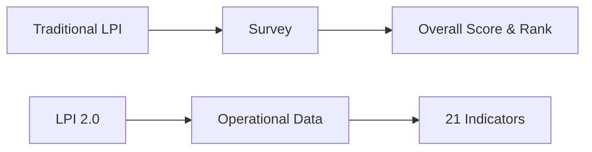
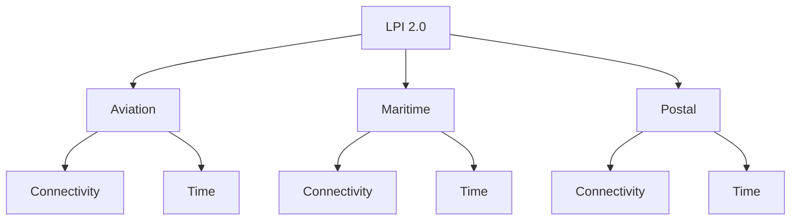
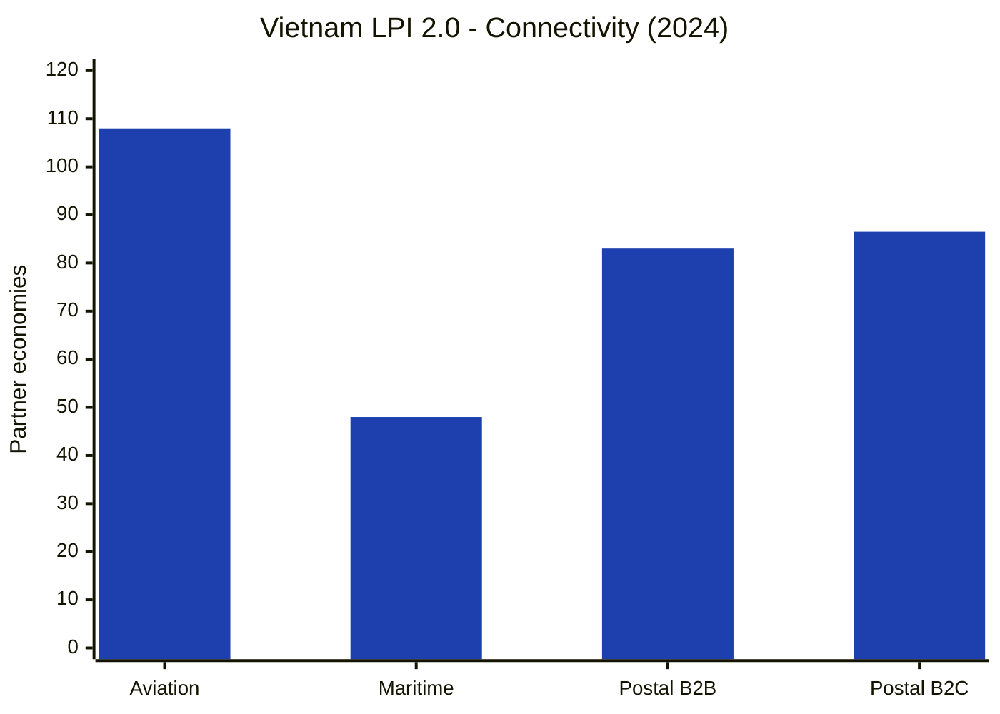
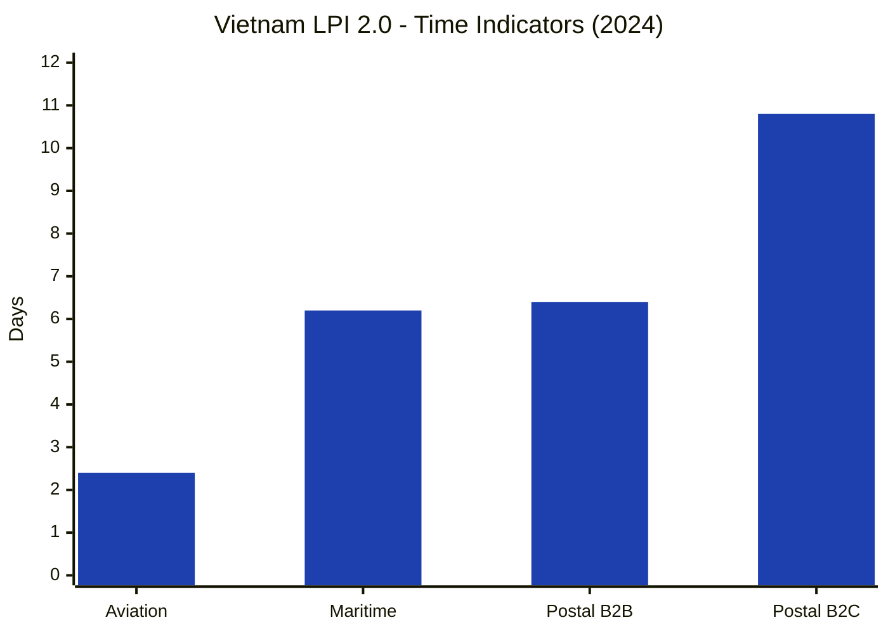

# World Bank LPI 2.0

## 1. What Is LPI 2.0?

**LPI 2.0** is the new logistics performance framework developed by the World Bank.

The main change is simple: it uses **actual shipment and tracking data** instead of relying mainly on surveys of logistics professionals.

The traditional survey-based LPI ended with the **2023 edition**. LPI 2.0 currently uses operational data for **2023 and 2024**.

> [!important] No overall score or rank
> LPI 2.0 does **not** give Vietnam one overall score or one overall ranking. Countries are compared separately across individual indicators.

## 2. Traditional LPI vs LPI 2.0

| Traditional LPI                     | LPI 2.0                                |
| ----------------------------------- | -------------------------------------- |
| Mainly survey-based                 | Based on operational shipment data     |
| Opinions of logistics professionals | Actual tracking and transport records  |
| 6 components                        | 21 indicators                          |
| Overall score from 1 to 5           | No single overall score                |
| Overall country ranking             | Ranking by individual indicator        |
| Used from 2007 to 2023              | Data currently available for 2023–2024 |

**From:** *What do logistics professionals think?*  
**To:** *What actually happened to shipments?*



## 3. How LPI 2.0 Is Structured

LPI 2.0 covers three logistics modes:

| Mode | Main Data |
| --- | --- |
| **Aviation** | Air cargo connections and airport dwell time |
| **Maritime** | Container movements, ports and shipping connections |
| **Postal** | International B2B and B2C postal shipments |

The framework has **6 core indicators** and **15 supplementary indicators**.

### Core Indicators

| Mode | Connectivity | Time |
| --- | --- | --- |
| **Maritime** | Maritime partner economies | Container import dwell time |
| **Aviation** | Aviation partner economies | Aviation import dwell time |
| **Postal** | B2B postal partner economies | B2B postal delivery time |



The supplementary indicators add more detail, especially for maritime logistics. Examples include **export dwell time, port turnaround time, transshipment time, import lead time, number of services, alliances, and transshipments**.

## 4. Vietnam in LPI 2.0

Selected values from the World Bank **Vietnam dashboard for 2024**:

| Area | Indicator | Vietnam 2024 |
| --- | --- | ---: |
| **Aviation** | Partner economies | **108** |
| | Import dwell time | **2.4 days** |
| **Maritime** | Partner economies | **48** |
| | Container import dwell time | **6.2 days** |
| | Number of alliances | **3.2** |
| | Number of services | **187.2** |
| | Number of transshipments | **0.6** |
| **Postal** | B2B partner economies | **83** |
| | B2B delivery time | **6.4 days** |
| | B2C partner economies | **86.5** |
| | B2C delivery time | **10.8 days** |

### Connectivity Snapshot



### Time Snapshot



> [!note] How to read the charts
> For **connectivity**, a higher number means more direct partner economies.  
> For **time indicators**, a lower number means goods spend less time in that part of the logistics process.

## 5. How to Read LPI 2.0

The traditional LPI allowed a statement such as:

> Vietnam's LPI score was **3.3 out of 5** in 2023.

LPI 2.0 works differently. Vietnam now has a **dashboard of indicators**, rather than one final score.

```text
Vietnam
│
├── Aviation
│   ├── Connectivity
│   └── Dwell time
│
├── Maritime
│   ├── Connectivity
│   ├── Dwell time
│   └── Other port and shipping indicators
│
└── Postal
    ├── B2B
    └── B2C
```

This makes it easier to see **where** logistics performs well or poorly instead of reducing everything to one number.

## 6. Summary

The biggest change is the move from **survey-based evaluation** to **actual logistics data**.

```text
Traditional LPI
Overall score + overall rank

        ↓

LPI 2.0
21 separate operational indicators
```

For Vietnam, the useful question is no longer *"What is Vietnam's LPI score?"* but rather *"How does Vietnam perform in aviation, maritime, and postal logistics?"*

---

## References

World Bank. *Logistics Performance Indicators 2.0 – About*.  
https://lpi.worldbank.org/en/about

World Bank. *LPI 2.0 Methodology*.  
https://lpi.worldbank.org/en/about/methodology

World Bank. *LPI 2.0 Indicators – Vietnam Dashboard*.  
https://lpi.worldbank.org/en/indicators/lpi-2-0
