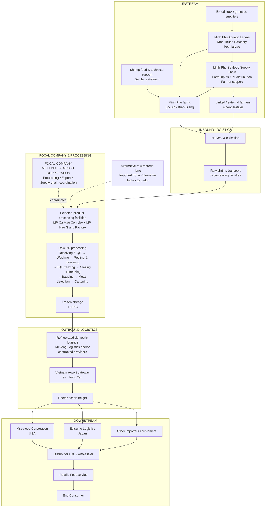

> [!NOTE]
> **Selected product:** Raw IQF Frozen Whiteleg Shrimp (*Penaeus vannamei*) – Peeled & Deveined (PD).  

# 1. Product and Scope

The selected product is **Raw IQF Frozen Whiteleg Shrimp (Vannamei) – Peeled & Deveined (PD)**. It is an export frozen-seafood product, processed by IQF and stored under frozen conditions.

     

More at [Tôm thẻ tươi](https://minhphu.com/types-of-shrimp/vannamei/)
# 2. Upstream

## Broodstock, feed and farming support

**De Heus Vietnam** provides shrimp feed, nutrition solutions and technical support for farming areas in Minh Phú's system. **Minh Phu Seafood Supply Chain** supports farming with post-larvae distribution, farm inputs, microbiological products and farmer support.

## Hatchery

**Minh Phu Aquatic Larvae / Minh Phu Ninh Thuan** produces shrimp post-larvae for the farming network. Minh Phú lists the hatchery as **BAP and GlobalG.A.P. certified**.

## Farming

Minh Phú's own farming network includes **Loc An (302 ha)** and **Kien Giang (600 ha)**, both farming Vannamei and Black Tiger shrimp. Raw material also comes from **linked farmers, cooperatives and external suppliers**. Minh Phú reported about **10% raw-material self-sufficiency from its own farming areas in 2024**, with a long-term target of about **50% by 2035**.

# 3. Inbound Logistics

Harvested shrimp is collected from Minh Phú farms and linked farming sources, then transported to processing facilities. For the **MPBiO premium lane**, Minh Phú describes live transport to the factory, IKEJIME handling and immediate processing.

# 4. Focal Company and Processing

**Minh Phu Seafood Corporation (MPC)** is the focal company in this supply chain. Its central role is **processing, export and supply-chain coordination**, while specialized subsidiaries and related entities handle hatchery, farming, logistics support and overseas sales.

For the selected Raw IQF Vannamei PD chain, the main processing facilities are **MP Ca Mau Complex** and **MP Hau Giang Factory**. Cà Mau is a major processing complex; Hậu Giang combines processing with frozen storage, packaging and convenient container-port access.

## Raw PD processing flow

**Receiving & QC → Washing → Peeling & deveining → Treatment / washing → IQF freezing → Glazing / refreezing → Bagging / sealing → Metal detection → Cartoning → Frozen storage**

Key temperatures: IQF freezing around **-33°C to -35°C**, product core after freezing **≤ -18°C**, glazing water around **0°C to 2°C**, and frozen storage **≤ -18°C**.

# 5. Outbound Logistics

After frozen storage, finished shrimp moves through refrigerated domestic logistics. **Mekong Logistics** provides cold storage, transport and container/port-related services, alongside other contracted providers. Export gateways vary by shipment; recent US-bound examples include **Vung Tau**. International transport uses **reefer ocean freight**.

# 6. Downstream

**Mseafood Corporation** is Minh Phú's US sales/downstream entity, while **Ebisumo Logistics** handles Minh Phú products for the Japanese market. Other markets use importers, distributors and wholesalers depending on destination.

Typical downstream flow: **Importer / sales entity → Distributor / DC / Wholesaler → Retail / Foodservice → End Consumer**.

# 7. Alternative Raw-Material Lane

Minh Phú also imports frozen Vannamei raw material, with recent trade records including origins such as **India and Ecuador**. This creates a second sourcing route that enters the processing stage directly rather than passing through Minh Phú's domestic hatchery and farming network.

# 8. Supporting Flows

- **Physical flow:** Inputs → Hatchery → Farms → Harvest → Processing → Frozen storage → Logistics → Export → Distribution → Consumer.
- **Traceability:** Hatchery records ↔ Farm records ↔ Harvest lot ↔ Processing lot ↔ Shipment documents ↔ Market compliance.
- **Order / forecast:** Overseas market ↔ Minh Phú sales/export planning ↔ Processing ↔ Farming/sourcing.
- **Financial flow:** Customer → Importer/distributor → Minh Phú → Farms/suppliers/logistics providers.

# 9. Main Supply-Chain Issues

- **Disease and biosecurity:** affects survival, yield and raw-material availability.
- **Raw-material availability:** depends on own farms, linked farmers, external sourcing and imported raw material.
- **Feed and farming inputs:** affect cost, nutrition and farm performance.
- **Cold-chain integrity:** frozen product must stay within required temperature conditions.
- **Food safety and traceability:** residue control, quality specifications and importer requirements are important for market access.
- **Export logistics:** reefer availability, port schedules, ocean lead time and customs clearance affect delivery.
- **Frozen inventory:** creates freezer-capacity, working-capital and demand-planning considerations.

# 10. Notes

- The **50% self-sufficiency** figure is a target toward **2035**, not the current level.
- **Mekong Logistics** is shown as a logistics service actor; its ownership structure changed in 2026.
- Factory capacity figures are omitted because Minh Phú's public materials are inconsistent between Cà Mau and Hậu Giang.
- Named final retailers are not necessary for this map; the last stages are shown by channel type.

# 11. References

- Minh Phú – Business Areas / Value Chain: https://minhphu.com/en/hoat-dong/
- Minh Phú – Raw Products: https://minhphu.com/en/collection/raw/
- Minh Phú – MPBiO: https://minhphu.com/en/brand/mpbio/
- Minh Phú Annual Report 2024: https://file.fpts.com.vn/FileStore2/File/2025/04/17/MPC_2025-4-17_57e367c_VI_Baocaothuongnien2024_signed.pdf
- Minh Phú Annual Report 2025: https://cafef1.mediacdn.vn/download/200426/mpc-bao-cao-thuong-nien-2025-0-609618.pdf
- Minh Phú audited 2025 financial statements: https://static2.vietstock.vn/vietstock/2026/3/30/2_mpc_2026_3_30_e6449c7_en_baocaotaichinh_ctyme_kiemtoan_2025_signed.pdf
- Cà Mau processing document: https://thamvan.mae.gov.vn/Uploads/03102023/22B%C3%A1o%20c%C3%A1o%20%C4%91%E1%BB%81%20xu%E1%BA%A5t%20c%E1%BB%A7a%20C%C3%B4ng%20ty.pdf
- Minh Phu Hau Giang processing document: https://thamvan.mae.gov.vn/Uploads/18072023/MQ2023%20BCdx%20cGPMT%20thuysan%20MPHG.pdf
- De Heus – strategic cooperation with Minh Phú: https://www.deheus.com.vn/kham-pha-va-hoc-hoi/tin-tuc/le-ky-ket-hop-tac-chien-luoc-giua-de-heus-minh-phu-ve-phat-trien-ben-vung-chuoi-gia-tri-nganh-tom
- Ebisumo Logistics: https://www.ebisumo.com/about
- Supporting shipment/trade sources: ImportInfo, NBD Trade Data, Volza, TradeIMEX.
